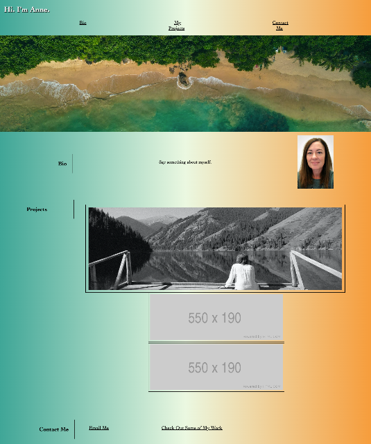
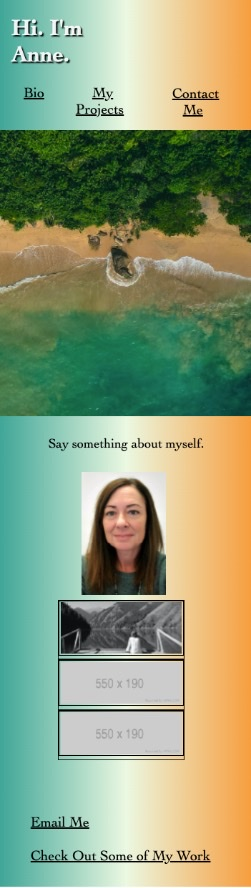

# CSS: Portfolio

## The Task

The task is to create a portfolio using semantic HTML and CSS. The nav links should connect to sections later in the UI. Currently, there are image placeholders that will be filled by projects as they are developed. 

Other details that need to be included are flexbox and media queries. 

## User Story

```
AS A potential employee
I WANT to provide a deployed portfolio showcasing work samples
SO THAT I can provide samples of my work and allow potential employers to assess whether I'm a good candidate for an open position
```

## Acceptance Criteria

Here are the critical requirements necessary for the portfolio that satisfies a typical hiring manager’s needs:

```
GIVEN I need to sample a potential employee's previous work
WHEN I load their portfolio
THEN I am presented with the developer's name, a recent photo or avatar, and links to sections about them, their work, and how to contact them
WHEN I click one of the links in the navigation
THEN the UI scrolls to the corresponding section
WHEN I click on the link to the section about their work
THEN the UI scrolls to a section with titled images of the developer's applications
WHEN I am presented with the developer's first application
THEN that application's image should be larger in size than the others
WHEN I click on the images of the applications
THEN I am taken to that deployed application
WHEN I resize the page or view the site on various screens and devices
THEN I am presented with a responsive layout that adapts to my viewport
```

### Resources Used
!(https://unsplash.com/photos/RuN8ydDoVuY) Hero image by Alexey Demidov

## Mock-Up

The following animation shows the web application's appearance and functionality:




!(https://amccorkl.github.io/Portfolio-2/)
!(https://github.com/amccorkl/Portfolio-2)


